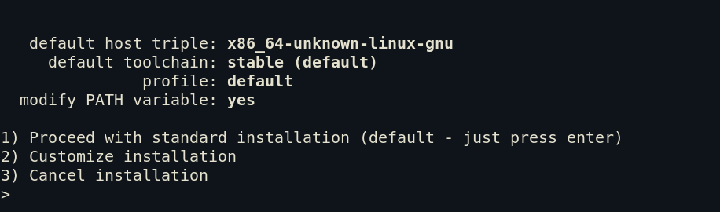
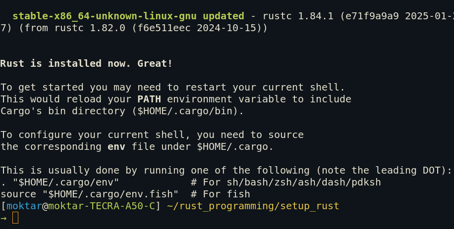
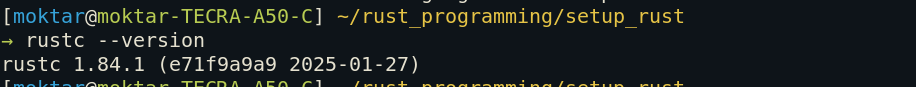
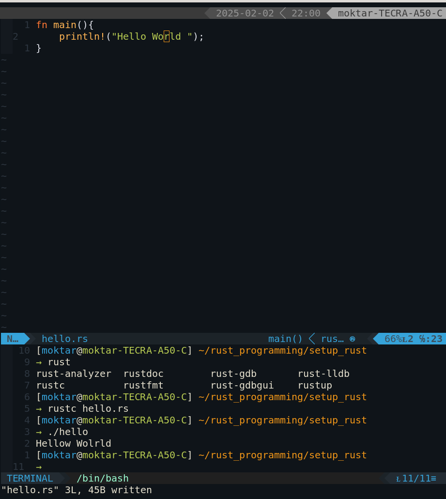

# Rust setup 
## Installation 
```bash
curl --proto '=https' --tlsv1.2 -sSf https://sh.rustup.rs | sh
```
- for a normal Installation Select 1: 



- After the Installation you will get this 



- Check if everything is working by running this command 



## Running an Example 
- Create a new file called `hello.rs`, and copy the code to the file. 
```rs
fn main(){
 println!("Hello World "); 
}
```
- Compiling 
```bash
rustc hello.rs 
```
- Running 
```bash
./hello 
```


